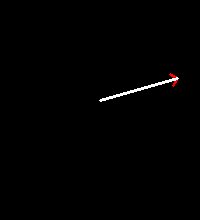

# Pytorch Image Regression
It is really common to find tutorials and examples of doing image **classification** but really hard to find simple examples of image **regression**, ie. predicting a vector from an image.

This repo is a super basic template for setting up an image regression task, loading images and csv data, training a network, and evaluating its performance on a test set.


# The simple regression task
The regression task set up here is purposefully simple. Our neural network should be able to absolutely crush this.

Given an image like this:



The network has to learn to regress a target which is the direction of the arrow as a 2d vector of length 1.0.
For this image the target answer is `0.9633736512703545,-0.2681626522057565`.


# The dataset
The dataset is in the folder `example_dataset`. It is split into 1000 training images and 100 test images.
For each of the `train` and `test` subdirectories there is also a csv file `train.csv` and `test.csv` respectively
that map the input image to the correct output answer.

This is what the first couple of lines of `train.csv` look like:
```
image_path,x,y
example_dataset/train/images/image_0.png,0.9633736512703545,-0.2681626522057565
example_dataset/train/images/image_1.png,0.39134577679470234,0.9202437084734407
```

The dataset is generated with the script `generate_sample_dataset.py`. If you just want to play around with the data or use this repo as a template for your own image regression task you won't need to run this script. If you do want to mess about with running it then you will also need to have `pandas` and OpenCV installed on your system.


# The data loader
The main useful bit of this repo is probably `data_loading.py`. In this file we define how the image and target loading is done. Specifically we use a subclass of `torchvision.datasets.ImageFolder` but we overload attributes such that it sets everything up as a regression task rather than a classification one.

This is the main useful bit of the data loader:
```
class RegressionImageFolder(datasets.ImageFolder):
    """
    The regression image folder is a subclass of the ImageFolder class and is designed for 
    image regression tasks rather than image classification tasks. It takes in a dictionary
    that maps image paths to their target values.
    """
    def __init__(
        self, root: str, image_targets: Dict[str, Any], *args: Any, **kwargs: Any
    ) -> None:
        super().__init__(root, *args, **kwargs)
        paths, _ = zip(*self.imgs)
        self.targets = [image_targets[str(path)] for path in paths]
        self.samples = self.imgs = list(zip(paths, self.targets))
```

# The network
The network is a simple CNN with a couple of convolutional layers and a couple of fully connected layers. It is defined in `network.py` and looks like this:
```
class CNNRegression(nn.Module):
    """
    This will be the very basic CNN model we will use for the regression task.
    """
    def __init__(self, image_size: Tuple[int, int] = (100, 100)):
        super(CNNRegression, self).__init__()
        self.image_size = image_size
        self.conv1 = nn.Conv2d(in_channels=1, out_channels=4, kernel_size=3, stride=1, padding=1)
        self.pool1 = nn.MaxPool2d(kernel_size=2, stride=2)
        self.conv2 = nn.Conv2d(in_channels=4, out_channels=16, kernel_size=3, stride=1, padding=1)
        self.pool2 = nn.MaxPool2d(kernel_size=2, stride=2)
        self.fc1 = nn.Linear(in_features=self.image_size[0]*self.image_size[1], out_features=128)
        self.fc2 = nn.Linear(in_features=128, out_features=2)
        
    def forward(self, x):
        """
        Passes the data through the network.
        There are commented out print statements that can be used to 
        check the size of the tensor at each layer. These are very useful when
        the image size changes and you want to check that the network layers are 
        still the correct shape.
        """
        x = self.conv1(x)
        # print('Size of tensor after each layer')
        # print(f'conv1 {x.size()}')
        x = nn.functional.relu(x)
        # print(f'relu1 {x.size()}')
        x = self.pool1(x)
        # print(f'pool1 {x.size()}')
        x = self.conv2(x)
        # print(f'conv2 {x.size()}')
        x = nn.functional.relu(x)
        # print(f'relu2 {x.size()}')
        x = self.pool2(x)
        # print(f'pool2 {x.size()}')
        x = x.view(-1, self.image_size[0]*self.image_size[1])
        # print(f'view1 {x.size()}')
        x = self.fc1(x)
        # print(f'fc1 {x.size()}')
        x = nn.functional.relu(x)
        # print(f'relu2 {x.size()}')
        x = self.fc2(x)
        # print(f'fc2 {x.size()}')
        return x
```
`network.py` also contains utility functions for training and evaluating the network, as well as saving and loading it. 

The network gets pretty good at this simple regression task. After 10 epochs it gets results like this:
```
Test Loss: 0.0001
Test mean angle error: 0.3546 degrees
```
so it can estimate the orientation of the arrow to within about 0.35 degrees.
